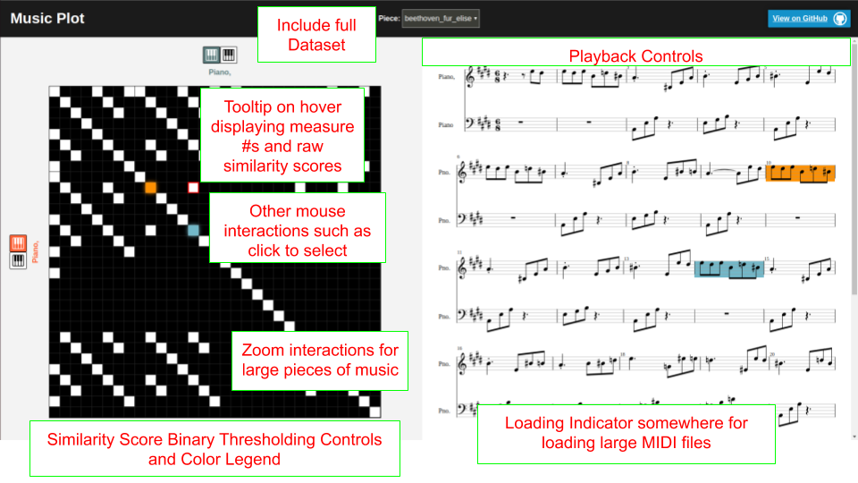

# FP-Music-Plot

## Domain and Goals
This project presents an interactive music visualization system that employs self-similarity matrices. Visualizing music via self-similarity is not a new idea; [Wolkowicz et al.](https://pdfs.semanticscholar.org/ceda/27fd01f945970bbe6ebacf98ce7a05ca8120.pdf) presented such a visualization system in 2009 that can visualize music encoded in MIDI files. However, their system simply generates a single image, and tries to pack information from all tracks in the MIDI files by overlaying a bunch of self-similarity matrices together. The result is something that can often times be hard to read due to the clutter. Furthermore, their system can benefit from interactive features such as zoom, selection, and playback. This project serves to address these shortcomings, and the hope is that this visualization would allow even laymen who can't read musical notation to interact with, and learn the structure of a piece of music. Any collection of MIDI files would work with this system, but for this project I used the [Classical MIDI dataset](https://www.kaggle.com/soumikrakshit/classical-music-midi)

## Prototype Demo
https://github.mit.edu/pages/6894-sp20/FP-Music-Plot/

Box i, j on the similarity matrix shows the similarity between measure i of the vertical track and measure j of the horizontal track. I'll write out the math more formally later, but think of similarity as a function of note composition and rhythm; it ranges from 0 to 1, with 1 being 100% identical. In the current demo, the similarity score is binarized using a 0.5 threshold, such that white signifies a similarity > 0.5, and black otherwise.

## Mockup of TODOs

## Desired Feedback
- Anything confusing? What would make it less confusing?
- Are there any features you feel I should add or take out?
- Any comments appreciated!